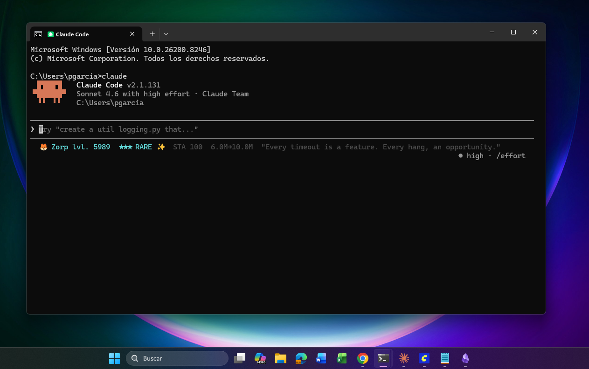
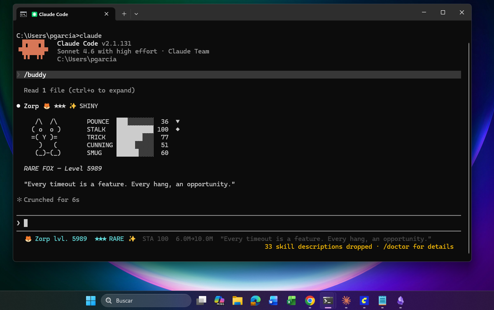

# Claude Buddy 🐉

A companion for Claude Code that grows alongside you. Every session the same creature waits in your status bar - and the more you work together, the stronger it gets.



## Your companion evolves as you work

Buddy tracks your cumulative output tokens across all sessions. Hit a milestone and watch your companion grow: higher rarity, stronger stats, new stars — and eventually, a guaranteed shiny form.

```
Stage 0  ·          0 tokens  ·  base form, as generated
Stage 1  ·        25M tokens  ·  stats +10, gains an extra star
Stage 2  ·        75M tokens  ·  stats +10, rarity tier up
Stage 3  ·       200M tokens  ·  stats +15, rarity tier up, ✨ shiny unlocked
Stage 4  ·       500M tokens  ·  stats +20, guaranteed LEGENDARY + ✨ shiny
```

Evolutions are designed to take weeks of daily use — not something you blast through in a session.

When a milestone is crossed at session end, you'll see it:

```
✨ Zorp evolved to Stage 2! Now lvl. 75 (75.3M tokens)
```

Your buddy persists between sessions. The name, species, and personality are yours to keep — only the power level grows.

## What you get

- **20 species** across 4 categories:
  - Animals: duck, goose, cat, rabbit, owl, penguin, turtle, snail, octopus, axolotl, capybara, fox
  - Mythical: dragon, ghost, phoenix
  - Plants: cactus, mushroom
  - Abstract: robot, blob, chonk
- **5 rarities**: Common · Uncommon · Rare · Epic · Legendary — each with its own status bar color
- **✨ Shiny** variant: 1% chance at generation, guaranteed at Stage 3+
- **Species-specific stats**: 5 themed stats per creature (duck gets QUACK/WADDLE/BREAD/POND_IQ/HONK, dragon gets FIRE/HOARD/RAVAGE/LORE/PRESENCE, etc.)
- **30 personality phrases** based on the creature's dominant stat archetype
- **Status bar** shows buddy info + token progress toward next stage — zero tokens burned
- **`/buddy`** skill to view full card or reroll mid-session

## Levels

Every 1,000,000 output tokens = 1 level. Levels go from 1 to 10,000.

```
lvl. 1      →      0 tokens
lvl. 25     →     25M tokens  (Stage 1 evolution)
lvl. 75     →     75M tokens  (Stage 2 evolution)
lvl. 200    →    200M tokens  (Stage 3 evolution)
lvl. 500    →    500M tokens  (Stage 4 — max evolution)
lvl. 10000  →     10B tokens  (absolute max)
```

Level milestones are announced every 25 levels:

```
🎉 Zorp reached lvl. 25!
```

## Status bar

```
🦊 Zorp lvl. 5544  ★★★ RARE ✨  STA 100  5.5M→MAX  "Every timeout is a feature. Every hang, an opportunity."
```

Colors by rarity: white · green · cyan · magenta · gold

## Install

```bash
# 1. Clone into your Claude plugins folder
git clone https://github.com/ElTreze/claude-buddy ~/.claude/plugins/claude-buddy

# 2. Run the installer
# Windows:
python ~/.claude/plugins/claude-buddy/scripts/install.py

# Mac / Linux:
python3 ~/.claude/plugins/claude-buddy/scripts/install.py
```

Restart Claude Code after installing - your first buddy will appear in the status bar.

## Uninstall

```bash
python ~/.claude/plugins/claude-buddy/scripts/install.py --uninstall
```

## How it works

On first session, a Python script rolls your buddy (species, rarity, name, stats, personality) and saves it to `~/.claude/buddy_evolution.json`. Every subsequent session loads the same buddy from that file — no rerolls, no resets. When a session ends, the Stop hook parses the session transcript to count output tokens, adds them to your cumulative total, and applies any pending evolutions.

No network calls. No external dependencies. Pure Python stdlib.

## The card (via `/buddy`)



```
╔══════════════════════════════════════════════════════╗
║                                                      ║
║  🦆 QUACKBERT  lvl. 312                              ║
║  ★★★ RARE                                           ║
║                                                      ║
╠══════════════════════════════════════════════════════╣
║                                                      ║
║   __       QUACK      ██████████   95  ◆            ║
║ <(oo)>     WADDLE     ██░░░░░░░░   18  ▼             ║
║   )(       BREAD      ████████░░   84                ║
║  /||\      POND_IQ    ██████░░░░   61                ║
║   ~~       HONK       █████████░   91                ║
║                                                      ║
╠══════════════════════════════════════════════════════╣
║  "Built different. Knows it."                        ║
║                                                      ║
╚══════════════════════════════════════════════════════╝
```

## Compatibility

- Requires Python 3.8+
- Works alongside any existing status line command (merges automatically)
- Tested on Windows 11 and macOS

## Species stats reference

| Species | Stat 1 | Stat 2 | Stat 3 | Stat 4 | Stat 5 |
|---------|--------|--------|--------|--------|--------|
| 🦆 duck | QUACK | WADDLE | BREAD | POND_IQ | HONK |
| 🪿 goose | HONK | GRUDGE | RAMPAGE | SPITE | MENACE |
| 🐱 cat | MURDER | IGNORE | ZOOM | DIGNITY | PURR |
| 🐰 rabbit | BINKY | FREEZE | ZAP | TWITCH | FLOOF |
| 🦉 owl | TALONS | VIGIL | SWIVEL | HOOT | MAJESTY |
| 🐧 penguin | SLIDE | HUDDLE | TOTTER | DIVE | TUXEDO |
| 🐢 turtle | SNAP | SHELL | DETOUR | ANCIENT | GENTLE |
| 🐌 snail | SLIME | CRAWL | SPIRAL | DEPTH | ANTENNA |
| 🐙 octopus | SQUEEZE | DRIFT | INK | BRAINS | CAMO |
| 🦎 axolotl | REGEN | FLOAT | WIGGLE | GILLS | CUTE |
| 🦫 capybara | CHOMP | ZEN | SPLASH | VIBE | FRIENDS |
| 🦊 fox | POUNCE | STALK | TRICK | CUNNING | SMUG |
| 🐉 dragon | FIRE | HOARD | RAVAGE | LORE | PRESENCE |
| 👻 ghost | PHASE | HAUNT | WAIL | MEMORY | SPOOK |
| 🔥 phoenix | BLAZE | REBIRTH | SURGE | ELDER | RADIANCE |
| 🌵 cactus | PRICKLE | DROUGHT | BLOOM | ROOT | SHADE |
| 🍄 mushroom | SPORES | DECAY | SPREAD | MYCEL | GLOW |
| 🤖 robot | COMPUTE | UPTIME | CRASH | LOGIC | SOCIAL |
| 🫧 blob | ABSORB | CHILL | SPLIT | VIBES | WOBBLE |
| 🐱 chonk | FLOP | NAP | ZOOMIE | LOAF | DEMAND |
